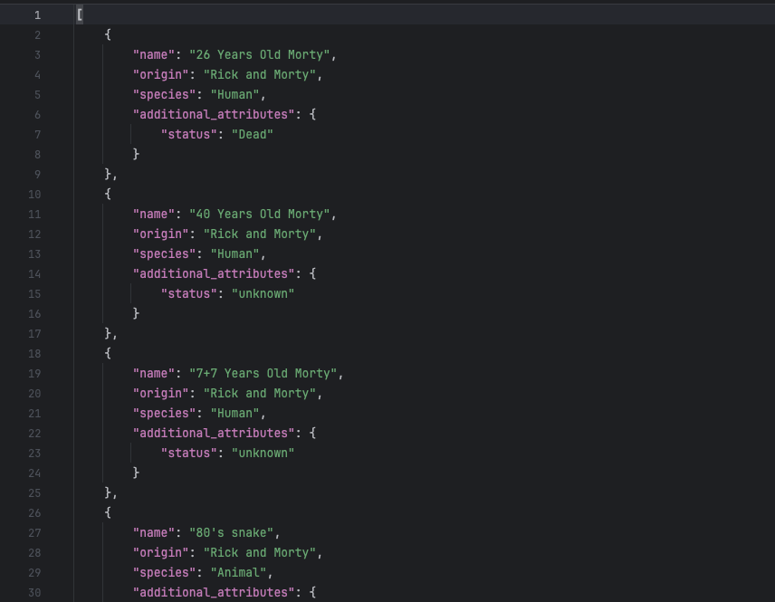

# Pulse Assignment
 
Fetch Data from the following APIs and normalize the data and store it in a file.

---

## Features
- Fetch data from the APIs and normalize the data.
- Store the normalized data in a file.
- Sort the output based on the name.
- Use LRU cache to store the data in memory for faster access.
- Use tenacity to retry the API calls in case of failure.
- Use recursion to fetch all the data from the APIs.
- Use FastAPI to create the API endpoints.
- Use Pytest for testing.
- Use flake8, isort, black and mypy for code quality checks.

---

## Requirements

- Python 3.9 or higher
- `pip` for package management

---

## Setup Instructions

### 1. Clone the Repository

```bash
git clone <repository-url>
cd <repository-name>
```

### 2. Create a virtual environment

```bash
python3 -m venv venv
source venv/bin/activate 
```

### 3. Install the dependencies

```bash
pip install -r requirements.txt
```

### 4. Run the server
```bash
uvicorn main:app --reload
```

The server will start at http://127.0.0.1:8000

You can access the API under http://127.0.0.1:8000/characters

After calling the API, the data will be stored in the file `characters.json` in the root directory.


### 5. Run the tests
```bash
python -m unittest tests/test_some.py 
python -m unittest tests/test_some.py -v # For verbose output
```

### 6. Integration Tests under tests/test_integration.py
```bash
python -m unittest tests/test_integration.py 
```

### 7. Code Quality Checks
Used flake8, isort, black and mypy for code quality checks.
These tools can be used under pre-commit hooks before committing the code or pushed to the repository.
```bash
isort . && black . && flake8 . && mypy .
```

### 8. Notes
- The application uses a file as database to store the normalized data.
- We are only saving data to the file and rewriting the whole file to update the data.
- There are no reads from the file.
- We are using lrucache to store the data in memory for faster access. In production, we can use a proper database like redis and store much more data/records.
- In order to fetch all data we are recursively fetching data from the APIs, other ways can be used like using a queue.
- Had to add a flag to the recursive function to avoid fetching too much data e.g; the Poke`mon API.
---